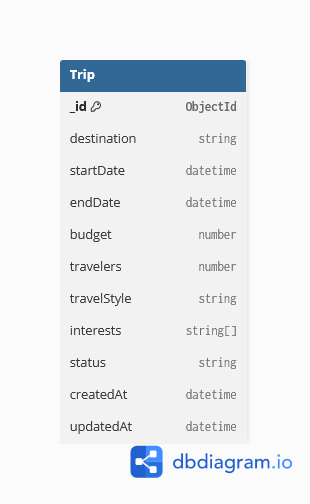

# TravelGenie AI – Personalized Eco-Tourism Planner

TravelGenie AI is a full-stack MERN application that helps users plan eco-friendly trips with a modern, responsive interface. It includes robust authentication via user registration, login, JWT credentials, and GitHub OAuth login. Security is enforced with protected frontend routes, protected backend APIs, and user-specific trip management. The application also integrates API request validation and rate limiting on critical authentication endpoints to safeguard user data.

---

## Project Status

- **Week 6 (Completed)**: Implemented secure User Authentication (Local signup/login, GitHub OAuth), Route Protection, Rate Limiting, and Input Validation.
- **Next Milestone**: AI itinerary generation using Google Gemini API to build personalized day-by-day itineraries, eco-friendly accommodation recommendations, and custom packing suggestions.

---

## Features

### Authentication & Security
- **User Registration**: Custom email and password signup.
- **User Login**: Traditional email and password authentications.
- **JWT Authentication**: Secured session management with JSON Web Tokens.
- **GitHub OAuth Login**: Integrated social login option via Passport.js.
- **Authentication Persistence**: Session persistence utilizing local storage context.
- **Protected Frontend Routes**: React Router checks guarding dashboard and trip screens.
- **Protected Backend Routes**: JWT middleware checking authorization headers.
- **User-owned Trips**: Database separation ensuring users only access their own trip documents.
- **Password Hashing**: Secure storage of passwords using bcrypt hashing.
- **Rate Limiting**: Custom security limits to protect auth routes from brute-force.
- **Input Validation**: Express-validator middleware validating correct payload structures.

### Trip Management
- **Create Trips**: Custom travel detail configurations.
- **View Trips**: Dedicated screens for viewing saved lists and detailed routes.
- **Update Trips**: Dynamic adjustments to existing trip plans.
- **Delete Trips**: Remove trip entries from account.
- **Search Trips**: Search saved trips by destination queries.
- **Filter Trips by Status**: Separate dashboard lists by Draft, Active, and Completed statuses.

### User Experience
- **Responsive UI**: Sleek mobile-first design built with Tailwind CSS.
- **AI Planner Interface**: Intuitive forms for drafting trip preferences.
- **Dashboard**: Centralized hub presenting user profile and trip overviews.
- **Dark Mode**: Toggleable dark mode interface.

### Backend
- **RESTful Express API**: Organized routing and controllers structure.
- **MongoDB Atlas**: Robust cloud storage for database documents.
- **Mongoose ODM**: Clean schema modeling and database queries.

---

## Tech Stack

### Frontend
- React
- Vite
- Tailwind CSS
- React Router

### Backend
- Node.js
- Express.js
- Passport.js
- JWT (jsonwebtoken)
- bcrypt
- express-session
- express-validator
- express-rate-limit

### Database
- MongoDB Atlas
- Mongoose

### Testing
- Postman

### Version Control
- Git
- GitHub

---

## Folder Structure

```
TravelGenie-AI/
│
├── backend/
│   ├── config/
│   ├── controllers/
│   ├── middleware/
│   ├── models/
│   ├── routes/
│   ├── services/
│   ├── utils/
│   ├── validators/
│   ├── server.js
│   ├── package.json
│   └── .env.example
│
├── src/
│   ├── components/
│   ├── pages/
│   ├── context/
│   ├── services/
│   ├── App.jsx
│   └── main.jsx
│
├── public/
│   ├── screenshots/
│   └── ...
├── package.json
└── README.md
```

---

## Database Schema

TravelGenie AI uses **MongoDB Atlas** as its primary database and **Mongoose** as the ODM (Object Document Mapper). MongoDB was chosen because of its flexible document-based schema, making it ideal for storing travel plans, user preferences, and future AI-generated itinerary data.

The current implementation is centered around the **Trip** model, which stores destination details, travel dates, budget, travel style, interests, trip status, and timestamps.



### Why MongoDB?

- Flexible document-oriented database suitable for evolving travel data.
- Easy integration with Node.js using Mongoose.
- Cloud-hosted on MongoDB Atlas with a free development tier.
- No complex schema migrations required for future AI features.
- Well-suited for MERN stack applications.

---

## Installation

### 1. Clone the repository

```bash
git clone https://github.com/<your-username>/TravelGenie-AI-Personalized-Eco-Tourism-Planner.git
cd TravelGenie-AI-Personalized-Eco-Tourism-Planner
```

### 2. Install frontend dependencies

```bash
npm install
```

### 3. Install backend dependencies

```bash
cd backend
npm install
cd ..
```

### 4. Run the frontend

```bash
npm run dev
```

The React app will be available at `http://localhost:5173`.

### 5. Run the backend

```bash
cd backend
npm run dev
```

The API server will be available at `http://localhost:5000`.

---

## Environment Variables

Create a `backend/.env` file by copying the example file:

```bash
cp backend/.env.example backend/.env
```

| Variable               | Description                                           |
| ---------------------- | ----------------------------------------------------- |
| `PORT`                 | Port for the Express server (default: `5000`)         |
| `MONGO_URI`            | MongoDB Atlas connection string                       |
| `JWT_SECRET`           | Secret key used to sign and verify JSON Web Tokens    |
| `SESSION_SECRET`       | Encryption key for session management                 |
| `GITHUB_CLIENT_ID`     | Client ID for GitHub OAuth Application                |
| `GITHUB_CLIENT_SECRET` | Client Secret for GitHub OAuth Application            |
| `FRONTEND_URL`         | URL of the React frontend application                 |
| `GEMINI_API_KEY`       | Google Gemini API key (reserved for future milestone) |

Example `backend/.env`:

```env
PORT=5000
MONGO_URI=mongodb+srv://<username>:<password>@<cluster>.mongodb.net/travelgenie?retryWrites=true&w=majority
JWT_SECRET=your_jwt_secret_key
SESSION_SECRET=your_session_secret_key
GITHUB_CLIENT_ID=your_github_client_id
GITHUB_CLIENT_SECRET=your_github_client_secret
FRONTEND_URL=http://localhost:5173
GEMINI_API_KEY=
```

---

## REST API Endpoints

### Authentication APIs

| Method | Endpoint                    | Description                                  |
| ------ | --------------------------- | -------------------------------------------- |
| POST   | `/api/auth/register`        | Register a new user account                  |
| POST   | `/api/auth/login`           | Log in with email and password               |
| GET    | `/api/auth/me`              | Fetch currently authenticated user's profile |
| GET    | `/api/auth/github`          | Redirect to GitHub OAuth consent page        |
| GET    | `/api/auth/github/callback` | Callback endpoint for GitHub authentication |

### Trip APIs

| Method | Endpoint                    | Description                          |
| ------ | --------------------------- | ------------------------------------ |
| POST   | `/api/trips`                | Create a new trip                    |
| GET    | `/api/trips`                | Retrieve all trips for logged-in user|
| GET    | `/api/trips/:id`            | Retrieve a specific trip by ID       |
| PUT    | `/api/trips/:id`            | Update a specific trip by ID         |
| DELETE | `/api/trips/:id`            | Delete a specific trip by ID         |
| GET    | `/api/trips/search`         | Search user's trips by destination   |
| GET    | `/api/trips/status/:status` | Filter user's trips by status        |

**Health check:** `GET /` returns server status.

**Search example:** `GET /api/trips/search?destination=Kerala`

**Filter example:** `GET /api/trips/status/Draft`

---

## Security Features

To guarantee data integrity and protect resources, the following features have been integrated:
- **JWT Authentication**: Custom middleware validates tokens in Authorization headers for secure session protection.
- **GitHub OAuth**: Secure delegation using Passport strategy, requesting minimal scopes and fetching verified email addresses.
- **Protected Routes**: Navigation-guard routes on the frontend (React Router) and API authorization on the backend (Express).
- **User Ownership Authorization**: Access constraints ensuring users can query, view, update, or delete only their owned trip documents.
- **Password Hashing**: One-way bcrypt hashing with a salt factor of 10 to protect user passwords in the database.
- **Authentication Rate Limiting**: Built-in protection against brute-force attacks via a 5-request maximum threshold per 15-minute window for login/register actions.
- **Request Validation**: Sanitization and validation of payload bodies via express-validator before controller execution.

---

## Screenshots

> Add screenshots to a `/screenshots` folder and replace the placeholders below.

### Home Page


### AI Planner


### My Recent Trips


### Backend API


---

## Future Improvements

- AI itinerary generation using Google Gemini API
- Personalized eco-friendly recommendations
- Smart budget predictions
- Real-time weather integration
- Interactive Maps integration
- Packing checklist generation
- Email itinerary export
- Real-time trip collaboration
- Multi-language support

---

## Author

**Karan Singh Dhanik**

Graphic Era University

Summer Internship Program 2026
